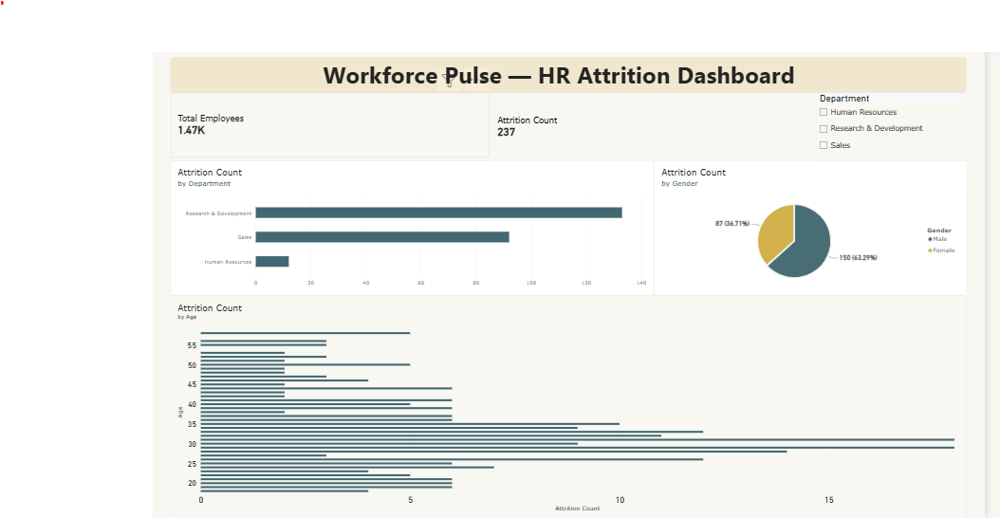

# Workforce Pulse Dashboard

## Project Overview
An interactive Power BI dashboard designed to analyze workforce data and provide insights into employee headcount, departments, job roles, demographics, and workforce trends.

## Key Features
- Total Employee analysis
- Department-wise workforce analysis
- Job role and demographic insights
- Interactive slicers and filters
- KPI cards and visual charts
- Data-driven workforce insights

## Tools & Technologies
- Power BI
- Power Query
- DAX
- Data Modeling
- Data Visualization

## Dashboard Preview

## Project Objective
To transform workforce data into an interactive and easy-to-understand dashboard that helps users identify workforce patterns and support data-driven HR decisions.
